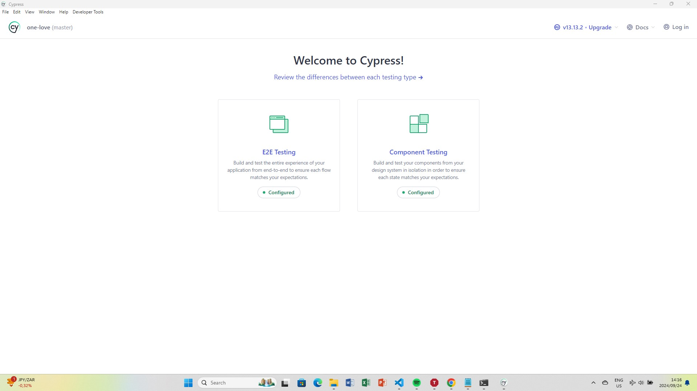
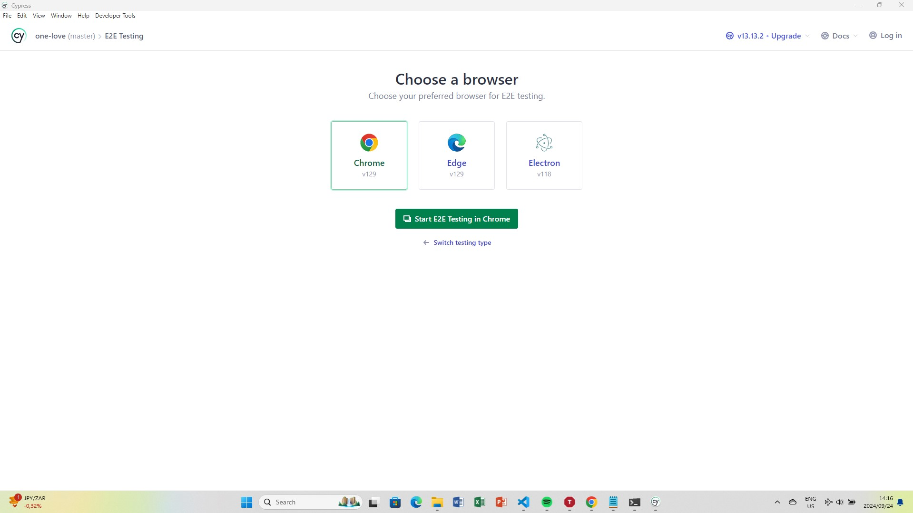
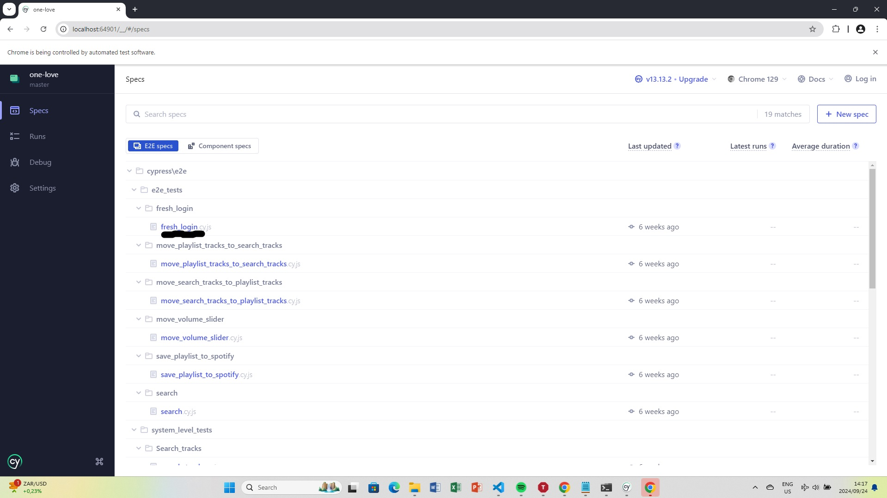
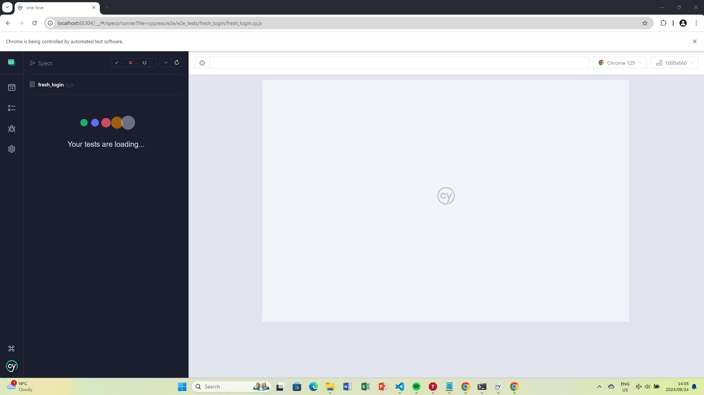

# One Love

## Disclaimer
The free Spotify API version only allows me to run the application with trusted developer spotify accounts so I created a spotify account that you need to log into if you want to use the application.

## Description:
This project is a part of a Codecademy course, designed to demonstrate my skills utilizing the React library and my knowledge of interacting with external APIs within a Single Page Application (SPA) format. It showcases features such as user authentication, dynamic data fetching, and responsive design, leveraging technologies like React, JavaScript, CSS Modules, and HTML. The goal was to build a React web app with a focus on state management and API integration, providing a seamless user experience with real-time data interactions. Additionally, the project served as an opportunity to learn and apply testing practices using Jest for unit testing and Cypress for end-to-end testing, ensuring robust and reliable application behavior.

## Table of Contents:
- [Installation](#installation)
- [Usage](#usage)
- [Configuration](#configuration)
- [Contributing](#contributing)
- [License](#license)
- [Acknowledgements](#acknowledgements)
- [Contact Information](#contact-information)

## Installation
To get started with this project, follow these steps:
1. **Clone the repository:**
   ```bash
   git clone https://github.com/PastorRowan/one-love.git
2.  **Navigate into the project directory:**
    ```bash
    cd one-love
3.  **Install dependencies:**
    ```bash
    npm install

## Usage
1. **Start the application:**
   - **Development:**
     ```bash
     npm start
     ```
   - **Create production build:**
     ```bash
     npm run build
     ```
   Note: npm run build will not run the production build it will just create it. You still need to host a static server to serve the react files. If you run npm start then the development server will be running on `http://localhost:3000`.
2. **Access the application:**
   Visit `http://localhost:3000`.
3. **Run tests:**
   - jest units tests:
      ```bash
      npm test
   - cypress e2e tests:
   1. Make sure the development or production server is running on http://localhost:3000 in another terminal. Please refer to the usage section for further instructions
   2. Navigate to the project directory within your terminal.
   3. run this command to open cypress:
      ```bash
      npx cypress open
      
   4. cypress should open, press e2e testing:
      
   3. Choose chrome or any modern browser should work, I used chrome for testing so I reccomend using that
      
   4. press select any test you want to run out of my spec
      
   5. the test should now be running
      
   

## Configuration:
none

## License:
Not licensed

## Acknowledgements:
- [Create React App](https://github.com/facebook/create-react-app) - for providing a great boilerplate for React applications.

## Contact Information:
For questions or feedback, please contact me at rowanvanzyl@gmail.com.
